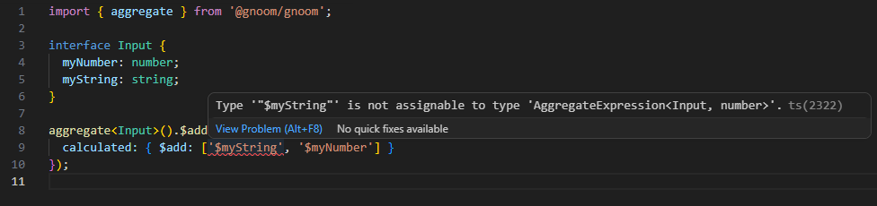
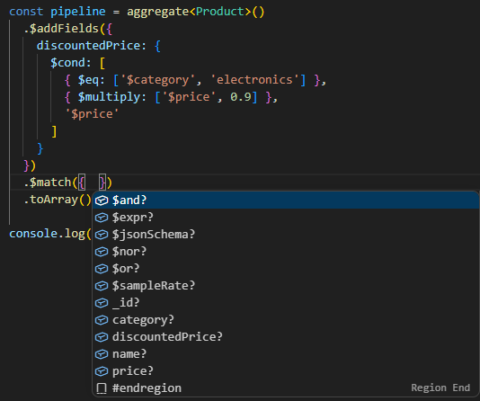
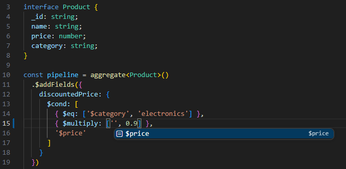
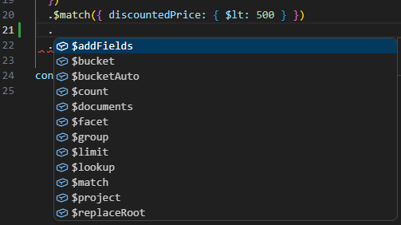

# Gnoom

Gnoom (pronounced gnome) is a library that allows you to build type-safe MongoDB aggregates. It has minimal runtime overhead, its main focus is
catching type-mismatches at compile time.

## Installation

It's an NPM package, you'll figure it out :)

## Usage

Simply import `aggregate`

```ts
import { aggregate } from '@gnoom/gnoom';

interface MyInputType {
  _id: ObjectId;
  score: number;
}

const pipeline = aggregate<MyInputType>()
  .$group({
    _id: null,
    totalScore: { $sum: '$score' }
  })
  .toArray();

// untyped way:
const unsafePipeline = [
  {
    $group: {
      _id: null,
      totalScore: { $sum: '$scores' }
      // Oops, made a typo
    }
  }
];
```

### Sub-pipelines

Certain aggregate stages like `$lookup` or `$facet` take an aggregate pipeline as an argument. In all of these cases gnoom takes a callback function instead.
For example

```ts
interface MySourceType {
  _id: ObjectId;
  foreignId: ObjectId;
}

interface MyTargetType {
  _id: ObjectId;
  status: string;
}

aggregate<MySourceType>().$lookup<MyTargetType>()({
  from: 'targetCollection',
  localField: 'foreignId',
  foreignField: '_id',
  pipeline: (p) => p.$match({ status: { $ne: 'closed' } }),
  as: 'document'
});
```

## Features

### Type-safety

The compiler will yell at you when you try to pass wrong types to operators.

#### Examples:

Trying to use `$add` to add a string to a number



### Autocomplete

Pipeline stages are fully typed, so required and optional inputs show up as you type. This includes document-specific properties, for example in the `$match` stage.

#### Examples:

Autocomplete property names



Autocomplete field path expressions based on available properties



Autocomplete available pipeline stages



### Type inference

Where possible the input type is transformed based on the aggregate stages as it passes through the pipeline. For example an `$addFields` stage will add the fields specified to the type, so we get the same type-safety benefits.

Note that in some cases inference isn't working (yet), in which case you can adjust the type manually by using several methods (`addToType`, `removeFromType`, `replaceType` and `modifyType`). For an example look in `examples/src/refine.ts`
